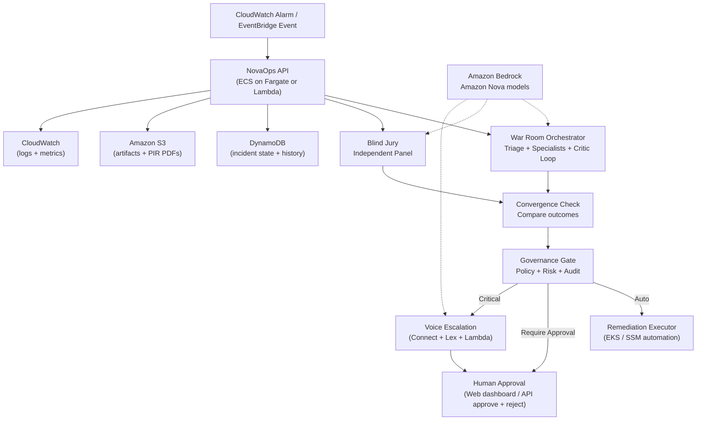

# NovaOps: Building an Autonomous SRE War Room on AWS with Amazon Bedrock (Amazon Nova), a Blind Jury, and Voice Escalation

> **Audience:** builders who want to design agentic systems that can safely interact with production infrastructure.
>
> **What you’ll get:** an end-to-end AWS-native reference architecture, design rationale, and implementation notes for an autonomous incident-response system built on Amazon Bedrock (Amazon Nova) with DynamoDB, S3, and Amazon Connect.
>
> **Repo context:** This post maps to the NovaOps codebase in the `incident-agent/` directory.

---

## TL;DR

NovaOps is a multi-agent SRE "war room" that investigates incidents end-to-end using Amazon Nova foundation models on Amazon Bedrock. It reduces hallucination risk by introducing an independent **Blind Jury** (a second reasoning path that never sees the War Room’s chain-of-thought). A **Convergence Check** compares War Room vs Jury outcomes, and a **Governance Gate** decides whether to auto-execute a remediation, require human approval, or deny.

For critical incidents, NovaOps can escalate by voice using **Amazon Connect + Lex V2 + AWS Lambda**, bridging the on-call conversation to Amazon Bedrock. Verbal **approve/reject** routes back through the same audited governance gate as dashboard/API approval.

---

## Why We Built NovaOps (and What Problem It Solves)

On-call incident response is not a single task; it’s a workflow:

1. Classify the incident (severity, domain, impacted service).
2. Pull evidence (logs, metrics, deployments, recent changes, Git history).
3. Form a hypothesis and validate it.
4. Propose a safe action (rollback, restart, scale, configuration revert).
5. Decide how risky it is to execute automatically.
6. Document everything for review, compliance, and post-incident reporting.

Large language models can help with steps (2)-(4), but *operational correctness and safety* are the hard part:

- When an LLM is wrong, it can still sound confident.
- An "agent" that can execute tools becomes a production blast-radius multiplier.
- Incident workflows require traceability: decisions must be auditable.

NovaOps treats safety and accountability as first-class requirements:

- **Dual independent reasoning paths** (War Room vs Blind Jury).
- **Hard gating** based on convergence + policy + risk.
- **Human-in-the-loop** controls that support both approval *and rejection*.
- **Append-only audit events** and on-disk artifacts for every incident.

---

## High-Level Architecture

The system has three core runtime planes:

- **Reasoning plane:** multi-agent investigation + independent jury validation.
- **Control plane:** governance gate + approvals + execution orchestrator.
- **Evidence plane:** storage (incident history + artifacts + audit events) + dashboard.



### What “Blind Jury” means in practice

The Jury is not a second pass over the War Room’s output. It is a separate reasoning job with strict inputs:

- It receives **raw incident context** and **telemetry summaries**.
- It does **not** receive the War Room’s hypothesis narrative or chain-of-thought.
- It deliberates in parallel among jurors with per-juror timeouts and failure isolation.

This is a practical technique to reduce **correlated failure**: if one reasoning path anchors incorrectly, the other path has a better chance of disagreeing.

---

## The Safety Gate: Critical Escalation, Convergence, and Governance

NovaOps uses multiple layers of gating:

1. **Convergence guard:** If War Room and Jury disagree, execution is forced to require human approval.
2. **Policy engine:** Rules determine when a class of incidents can be auto-executed.
3. **Risk scoring:** Incidents are risk-ranked (severity, blast radius, confidence, domain, etc.).
4. **Approval token (optional):** approvals can require a shared secret header to prevent unintended automation.

### A minimal math framing

Critical escalation can be treated as:

\[
\text{critical} \iff (\text{severity} \in S_{\text{critical}})\ \lor\ (r \ge \tau)
\]

Where:

- \(S_{\text{critical}}\) is a configurable set (e.g., \(\{P1\}\))
- \(r\) is a risk score emitted by governance
- \(\tau\) is a configurable threshold (e.g., \(85\))

Even when \(\text{critical} = \text{true}\), NovaOps does not automatically execute; it escalates to a human decision path and preserves the audit trail.

---

## Implementation Walkthrough (Deep Dive)

This section is structured as: **component goals**, **how it works**, and **what to look for in the code**.

### 1) Backend API (FastAPI)

**Goal:** be the system’s stable contract.

Responsibilities:

- Alert ingestion (for example, via EventBridge or a webhook)
- Incident history API (`GET /api/incidents`, `GET /api/incidents/{id}`)
- Action gating endpoints (`POST /api/incidents/{id}/approve`, `POST /api/incidents/{id}/reject`)
- Artifact serving for reports/PIRs, dashboard support endpoints

**Design notes:**

- Approve and reject are symmetric on purpose: a real operator needs a way to say "no" and have it recorded.
- Approvals can be protected by `NOVAOPS_APPROVAL_TOKEN` requiring header `X-NovaOps-Approval-Token`.

### 2) War Room Agents (multi-agent investigation)

**Goal:** reconstruct causality from heterogeneous evidence.

War Room pipeline shape:

1. Triage: domain/severity/service classification.
2. Parallel specialists:
   - Logs
   - Metrics
   - Infrastructure (for example, Amazon EKS cluster state)
   - Deployment context (for example, recent release metadata and change events)
3. Synthesis: root-cause hypothesis.
4. Critic loop: adversarial evaluation and revision.
5. Remediation plan: propose tool + parameters (rollback, restart, etc.)

**Key idea:** the War Room is allowed to be "deep" and iterative, but it is not trusted blindly. It must be validated.

### 3) Blind Jury (independent validation)

**Goal:** reduce false positives and correlated hallucinations.

Jury traits:

- Isolated prompts
- Independent jurors
- Parallel execution with per-juror timeouts
- Produces: verdict, confidence, reasons, and any escalation signals

Convergence then compares:

- The recommended action/tool
- The hypothesized root cause
- Whether escalation flags are present

If they disagree (or if jury escalates), governance hard-gates to `REQUIRE_APPROVAL`.

### 4) Governance + Audit

**Goal:** enforce policy and preserve traceability.

Governance produces:

- A decision: auto-execute vs require approval vs deny
- A risk score and decision rationale
- An append-only audit stream (events like `ALERT_RECEIVED`, `CONVERGENCE_CHECK`, `HUMAN_REJECTED`)

This is the “control plane” layer that makes the system reviewable and safe.

### 5) Voice escalation (Amazon Connect + Lex V2 + Lambda + Bedrock)

**Goal:** critical incidents should reach a human via the fastest channel, with a structured decision protocol.

Flow:

1. Backend classifies incident as critical (severity list and/or risk threshold).
2. Backend composes:
   - a short "briefing script" for TTS (kept concise on purpose)
   - a full system prompt for the conversational model
3. Amazon Connect places outbound call.
4. Connect flow:
   - plays briefing via Polly
   - routes to Lex V2 bot
5. Lex fulfillment Lambda:
   - calls `bedrock.converse()` (Amazon Nova)
   - detects `[ACTION_APPROVED]` / `[ACTION_REJECTED]`
   - calls back to NovaOps API to approve/reject

**Safety notes:**

- Callbacks can be protected by the same approval token.
- Lambda ignores unexpected callback URLs to reduce SSRF-style risk.

### 6) Knowledge capture: PIR \(\rightarrow\) concise runbook distillation

**Goal:** turn incidents into reusable operational knowledge without ballooning context.

NovaOps produces multiple artifact layers:

- A detailed investigation narrative (useful for humans and post-incident review).
- A governance record (decision + rationale).
- A *distilled* runbook suitable for retrieval in future incidents.

In production, a practical pattern is:

1. Store full artifacts in **S3** under a stable prefix (for example `plans/<incident_id>/...`).
2. Extract a concise runbook that is intentionally short and structured:
   - symptoms / signals
   - root cause
   - remediation steps
   - verification steps
   - rollback and safety notes
3. Index distilled runbooks in an **Amazon Bedrock Knowledge Base** (or another retrieval layer) so future investigations can pull high-signal context.

This “distill then retrieve” approach keeps the knowledge base clean and avoids feeding entire prior reports back into the model, which can otherwise lead to runaway context growth and low-quality retrieval.

---

## AWS Reference Deployment (Production-First)

NovaOps is designed to run as an AWS-native incident-response control plane:

- **Signals:** Amazon CloudWatch (alarms, logs, metrics) routed via Amazon EventBridge
- **Reasoning:** Amazon Bedrock (Amazon Nova models)
- **Control plane API:** containerized FastAPI app on **Amazon ECS with AWS Fargate** (or serverless via **AWS Lambda + Amazon API Gateway**)
- **State:** **Amazon DynamoDB** for incident state/history
- **Artifacts:** **Amazon S3** for investigation artifacts and PIR PDFs
- **Voice escalation:** **Amazon Connect + Amazon Lex V2 + AWS Lambda**
- **Execution:** **Amazon EKS** (Kubernetes) and/or **AWS Systems Manager Automation** for remediation

### Recommended production request flow

1. **Detection:** CloudWatch Alarm (or a custom operational signal) emits an EventBridge event.
2. **Ingestion:** EventBridge routes the event to the NovaOps API (or a lightweight adapter Lambda).
3. **Investigation:** NovaOps runs War Room + Blind Jury reasoning on Amazon Bedrock and persists intermediate state in DynamoDB.
4. **Decision:** Convergence + governance decision is written to DynamoDB and audit artifacts are written to S3.
5. **Action:** Depending on governance:
   - Auto: remediation executor runs (for example against EKS or SSM).
   - Approval: the dashboard exposes approve/reject endpoints (with optional token header).
   - Critical: voice escalation calls the on-call engineer via Connect and records verbal approve/reject.

### DynamoDB and S3 layout (suggested)

- DynamoDB table: partition key `incident_id` (string), attributes for status, timestamps, proposed tool, action parameters, and audit pointers.
- S3 bucket layout:
  - `s3://<bucket>/plans/<incident_id>/report.md`
  - `s3://<bucket>/plans/<incident_id>/governance.json`
  - `s3://<bucket>/plans/<incident_id>/audit.jsonl`
  - `s3://<bucket>/plans/<incident_id>/pir.pdf`

### Health, readiness, and safety gates (AWS-native)

In production, prefer managed readiness primitives:

- **ALB health checks** for the API service
- **ECS deployment circuit breaker** (rollback on unhealthy tasks)
- bounded retries + exponential backoff for downstream calls (DynamoDB, S3, Bedrock)

> Note: For local-only development and deterministic tests, NovaOps can use a lightweight SQLite store, but **production uses DynamoDB**.

---

## Key API Endpoints (Control Plane)

```text
GET  /api/incidents               — list recent incidents (dashboard feed)
GET  /api/incidents/{id}          — get incident, status, and artifacts
POST /api/incidents/{id}/approve  — approve execution (optional token header)
POST /api/incidents/{id}/reject   — reject execution (record audit + governance artifact)
GET  /api/governance/{id}/audit   — fetch append-only audit event stream
```

---

## Configuration (Selected Environment Variables)

This is the short list you’ll typically configure in an AWS deployment:

- `AWS_DEFAULT_REGION=us-east-1` (example)
- `NOVA_MODEL_ID=us.amazon.nova-2-lite-v1:0` (example Bedrock inference profile)
- `NOVAOPS_USE_MOCK=true|false` (use fixtures for deterministic evaluation runs)
- `NOVAOPS_APPROVAL_TOKEN=...` (optional: require `X-NovaOps-Approval-Token` for approve/reject)

Critical escalation policy:

- `CRITICAL_SEVERITY_LEVELS=P1` (example)
- `CRITICAL_RISK_SCORE_THRESHOLD=85` (example)
- `NOVAOPS_VOICE_ESCALATION_ENABLED=true|false`

Voice escalation (Amazon Connect + Lex):

- `NOVAOPS_VOICE_USE_MOCK=true|false` (mock logs calls instead of dialing)
- `CONNECT_INSTANCE_ID=...`
- `CONNECT_CONTACT_FLOW_ID=...`
- `CONNECT_SOURCE_PHONE=+15551234567`
- `ONCALL_PHONE_NUMBER=+15559876543`
- `NOVAOPS_API_CALLBACK_URL=https://<your-api-domain>` (the base URL Lex/Lambda calls back to)

---

## Observability: Artifacts, Logs, and Audit Trails

One thing we treated as a product requirement (not "nice to have") is *reviewability*.

NovaOps emits:

- **CloudWatch Logs** for a unified, queryable event stream (API + orchestrator + execution)
- **CloudWatch Metrics** for operational KPIs (MTTR, auto-vs-approval rate, convergence rate, execution success rate)
- **S3 artifacts** per incident (immutable evidence you can review after the fact):
  - `report.md` (investigation narrative)
  - `governance.json` and `governance_report.md` (decision + rationale)
  - `audit.jsonl` (append-only audit events)
  - `voice_escalation.json` (call status, briefing, escalation reasons)
  - `pir.pdf` (post-incident report)

This makes the system explainable and auditable: you can replay an incident from artifacts alone, without relying on ephemeral console output.

---

## Security and Safety Considerations (What We Hardened)

Even in a hackathon prototype, incident tooling touches sensitive surfaces.

We focused on pragmatic, high-value safeguards:

- **Approval token header (optional)** for approve/reject endpoints to prevent unintended automation.
- **Callback URL handling** in voice Lambda to reduce SSRF-style risk.
- **Audit-first design** so every decision and action is traceable to an incident artifact.

If you adapt NovaOps for real production use, you’d add:

- AuthN/Z (Amazon Cognito or IAM-based auth)
- Per-action permissioning and scoped execution credentials
- Stronger secret management (AWS Systems Manager Parameter Store / AWS Secrets Manager)
- KMS encryption at rest (DynamoDB + S3) and strict bucket/table policies
- API Gateway authorizers / WAF protections for public endpoints
- VPC endpoints for DynamoDB/S3/Bedrock (where available) to reduce egress exposure
- Dedicated audit storage and retention controls

---

## Testing Strategy

Agent systems are notoriously hard to test unless you intentionally design for it.

NovaOps uses:

- Mock modes to keep tests deterministic
- Structured schemas and typed artifacts
- Unit and integration tests across policy, voice escalation, and server workflows

Run the full suite:

```bash
python -m unittest discover -s tests -v
```

---

## Lessons Learned

1. **Safety is an architecture problem.** The Blind Jury and Convergence Check changed the entire risk profile of the system.
2. **Human-in-the-loop must include rejection.** Approve-only flows are not realistic in operations.
3. **Memory hygiene matters.** Distilling concise runbooks (instead of storing entire reports) prevents runaway context growth and keeps retrieval useful.
4. **Artifacts are the UI.** In incident response, the paper trail is often as important as the action itself.

---

## What’s Next

If we continued NovaOps beyond hackathon scope:

- Expand governance policies (per-service risk profiles, change windows, explainability constraints).
- Deepen AWS integrations (CloudWatch alarms, EventBridge routing, EKS/SSM remediation, and CI/CD rollback hooks).
- Increase evaluation coverage and introduce regression scoring to track reliability improvements over time.

---

## Appendix A: A Concrete Critical-Incident Flow (Example)

Here’s how a critical incident should feel in practice:

1. Alert hits NovaOps.
2. War Room investigates and proposes a rollback.
3. Blind Jury independently validates the rollback is consistent with telemetry.
4. Governance marks it critical (P1 or high risk).
5. System escalates via voice call and records the decision protocol.
6. Engineer approves or rejects (verbal approval or via the dashboard/API).
7. Governance gate executes rollback.
8. Audit and artifacts capture every step.

This is the difference between “an LLM demo” and “an incident tool you can reason about.”

---

## Appendix B: Incident Data Model (DynamoDB + S3)

In production, NovaOps uses:

- **Amazon DynamoDB** for incident state and history
- **Amazon S3** for immutable per-incident artifacts (reports, audit logs, PIR PDFs)

At a high level, each incident is identified by a unique `incident_id` and carries:

- **Classification:** `severity`, `domain`, `service_name`, `alert_name`
- **Decisioning:** `proposed_tool`, `action_parameters`, `status`
- **Narrative:** `analysis`
- **Artifact pointers:** `s3_prefix` or `artifact_keys` (plus PIR PDF location)
- **Time:** `timestamp`

> Local-only note: NovaOps can use a lightweight SQLite store for development and tests, but production uses DynamoDB.

### DynamoDB table design

Primary key:

- Partition key: `incident_id` (string)

Typical attributes stored:

```json
{
  "incident_id": "INC-20260315-180029-12f165",
  "timestamp": "2026-03-15T18:00:29",
  "service_name": "payments",
  "alert_name": "HighMemoryUsage_OOMKilled",
  "domain": "oom",
  "severity": "P1",
  "analysis": "Root cause hypothesis + evidence summary ...",
  "proposed_tool": "rollback_deployment",
  "action_parameters": "{\"service_name\":\"payments\"}",
  "status": "plan_ready",
  "artifacts_prefix": "plans/INC-20260315-180029-12f165/"
}
```

**Why is `action_parameters` a JSON string?**

It keeps the storage interface stable and avoids schema drift as tools evolve, while still allowing the execution layer to parse a canonical structure at runtime.

### S3 artifact layout

Suggested layout:

```text
s3://<bucket>/plans/<incident_id>/report.md
s3://<bucket>/plans/<incident_id>/governance.json
s3://<bucket>/plans/<incident_id>/audit.jsonl
s3://<bucket>/plans/<incident_id>/voice_escalation.json
s3://<bucket>/plans/<incident_id>/pir.pdf
```

---

## Appendix C: Storage Backend Selection (and why it matters)

When you use DynamoDB as your system-of-record for incidents, you can turn *operational safety properties* into database guarantees.

### 1) Idempotency by design

Most incident operations are naturally idempotent if you model them correctly:

- Create incident: "put this `incident_id` if it doesn’t already exist"
- Start execution: "transition status from `plan_ready` to `execution_started` exactly once"
- Approve/reject: "record human decision if and only if the incident is still pending"

DynamoDB supports this with conditional expressions.

### 2) Safe status transitions with conditional writes

Example: start execution only once.

```text
UpdateItem(
  Key = { incident_id },
  UpdateExpression = "SET #s = :started, execution_started_at = :now",
  ConditionExpression = "#s = :plan_ready",
  ExpressionAttributeNames = { "#s": "status" },
  ExpressionAttributeValues = {
    ":plan_ready": "plan_ready",
    ":started": "execution_started",
    ":now": "2026-03-15T18:00:29Z"
  }
)
```

If two workers race, only one update succeeds.

### 3) Streams for event-driven workflows (optional)

If you want to decouple the pipeline:

- DynamoDB Streams can emit status transitions.
- A Lambda consumer can trigger follow-on steps (e.g., kick off execution when governance says auto).

This lets you scale investigation and execution independently while preserving a single state machine in DynamoDB.

---

## Appendix D: Securing Human Approval on AWS (Cognito + API Gateway)

In production, approval endpoints are high-impact. Treat them like privileged control-plane APIs.

Recommended AWS-native patterns:

- **Amazon Cognito** for operator authentication (dashboard sign-in)
- **API Gateway JWT authorizers** (or an ALB + OIDC integration) to protect approve/reject endpoints
- **AWS WAF** for basic layer-7 protections on public endpoints
- **Least-privilege IAM** roles for the API task/Lambda and execution workers
- **KMS encryption at rest** for DynamoDB and S3 artifacts
- **VPC endpoints** for DynamoDB/S3/Bedrock (where available) to reduce egress exposure

NovaOps also supports a pragmatic “break glass” hardening mechanism:

- `NOVAOPS_APPROVAL_TOKEN` requires `X-NovaOps-Approval-Token` for approve/reject.

This is especially useful for service-to-service callbacks (for example, the Lex fulfillment Lambda calling back to the API) even when you also deploy a full identity layer.

---

## Appendix E: Voice Escalation Details (Connect + Lex + Lambda + Bedrock)

Voice escalation is where “agentic UX” meets “operational risk,” so NovaOps keeps the protocol explicit:

- The model must emit `[ACTION_APPROVED]` or `[ACTION_REJECTED]` to trigger side effects.
- Anything else is treated as conversation only.

### Contact Flow attributes (example)

When placing a call, NovaOps sets Connect contact attributes such as:

- `incident_id`
- `briefing_script` (short TTS message)
- `severity`, `service_name`
- `callback_url` (API base URL)

Connect can then:

- play `briefing_script` via Polly
- route to a Lex bot for conversation

### Lex session attributes and conversation memory

The Lambda handler maintains conversation state in Lex session attributes. This is pragmatic:

- It keeps the call stateful without external databases.
- It lets you trim conversation history to a fixed budget (NovaOps trims to a bounded number of messages).

### Bedrock invocation pattern

The Lambda uses Amazon Bedrock’s conversation interface to produce the next assistant turn using Amazon Nova.

Implementation details to keep it robust:

- conservative prompt structure (short instructions + explicit tokens)
- trimmed history windows to avoid context bloat
- fallback behavior when Bedrock errors (end gracefully and log)

### Callback hardening

NovaOps uses a configured base callback URL (`NOVAOPS_API_CALLBACK_URL`) and ignores unexpected callback URLs to reduce SSRF-style risks. If `NOVAOPS_APPROVAL_TOKEN` is set, the Lambda includes `X-NovaOps-Approval-Token` for approve/reject callbacks.

---

## Appendix F: Governance and Audit Vocabulary

NovaOps emits audit events that let you reconstruct “what happened” without scraping logs.

Example event types:

| Event | Actor | Meaning |
|---|---|---|
| `ALERT_RECEIVED` | SYSTEM | Webhook ingested |
| `TRIAGE_COMPLETE` | SYSTEM | Domain/severity/service classified |
| `HYPOTHESIS_FORMED` | SYSTEM | Root cause ranked |
| `CRITIC_VERDICT` | SYSTEM | Adversarial review completed |
| `CONVERGENCE_CHECK` | SYSTEM | War Room vs Jury compared |
| `GOVERNANCE_DECISION` | SYSTEM | Policy evaluated, risk scored |
| `EXECUTION_STARTED` | SYSTEM/HUMAN | Tool execution begins |
| `EXECUTION_COMPLETE` | SYSTEM/HUMAN | Tool execution result |
| `HUMAN_OVERRIDE` | HUMAN | Manual approval via `/approve` |
| `HUMAN_REJECTED` | HUMAN | Manual denial via `/reject` |

This vocabulary is intentionally small and composable so it can back multiple outputs:

- a dashboard timeline
- incident postmortems
- compliance audit exports

---

## Appendix G: Performance and Reliability Notes (Parallel Jury, Timeouts, and Idempotency)

Agentic systems can fail in non-obvious operational ways (slow endpoints, locked DBs, huge logs).

NovaOps includes several pragmatic mitigations:

- Jury deliberation is parallelized with per-juror timeout isolation.
- DynamoDB conditional writes enable safe state transitions under concurrency (for example, starting execution exactly once).
- Timeouts and bounded retries are applied to external calls (Bedrock, DynamoDB, S3, Connect) to avoid pipeline deadlocks.

These are small changes, but they matter when you’re demoing live: a system that “mostly works” but hangs under load is hard to trust.

---

## Appendix H: Code Map (Where to Read Next)

If you want to go deeper, start here:

- `api/server.py`:
  - HTTP routes, approvals/rejections, artifacts, and control-plane wiring
- `api/history_db.py`:
  - DynamoDB-backed incident store (with local dev fallback)
- `governance/gate.py`, `governance/audit_log.py`, `governance/report.py`:
  - decisioning, audit vocabulary, governance artifacts
- `lambda_handlers/nova_connect_handler.py`:
  - Lex fulfillment Lambda bridging voice conversation to Bedrock and back to API
- `api/connect_caller.py`, `api/voice_summary.py`:
  - outbound call placement + safe voice prompt construction
- `tools/k8s_actions.py`:
  - remediation primitives (rollback, etc.)
