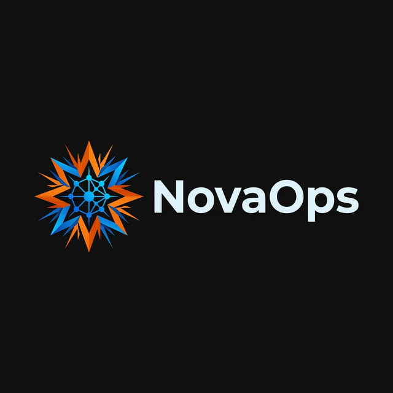

# NovaOps: The Autonomous SRE War Room

## Inspiration

NovaOps was born from the high-pressure reality of modern SRE work. When a production incident hits at 3 AM, the response is often a chaotic race against time—juggling logs, metrics, and deployment diffs while fighting fatigue. We realized that while LLMs are good at summarization, "almost correct" conclusions are dangerous in production. 

Our inspiration was to build a system that doesn't just "chat" about incidents, but active **investigates** them with the same rigor as a human team, using a multi-agent "war room" that challenged itself through a blind jury to ensure every remediation is safe, audited, and strictly verified.

---

## What It Does

NovaOps is an **autonomous multi-agent SRE ecosystem** powered by the Amazon Nova 2 family of foundation models. It transforms reactive incident response into a proactive, self-learning lifecycle:

- **Autonomous Triage:** Ingests alerts and immediately dispatches a specialized task force.
- **Agentic War Room:** Parallel agents (Log Analyst, Metrics Specialist, Infra Guard, GitHub Historian) collaborate to find the root cause.
- **The Blind Jury:** An isolated peer-review panel validates findings independently to eliminate AI hallucinations.
- **Governance Gate:** A hard execution gate that evaluates risk scores and enforces convergence before any Kubernetes action.
- **Voice-Driven Approval:** Critical actions trigger real-time phone calls via **Amazon Nova Sonic**, allowing engineers to approve or reject remediation verbally.

---

## How We Built It

### Backend API (FastAPI)
We built a high-performance orchestration core using FastAPI to handle incident state machine transitions, artifact generation, and secure approval callbacks. It bridges local developer environments (SQLite) with production-ready cloud backends (DynamoDB).

### Multi-Agent Pipeline
The "Brain" is a graph-based orchestration layer that manages a Triage → Analyst → Reasoner → Critic loop. This allows for iterative refinement where specialist agents challenge each other until a high-confidence remediation is found.

### Independent Jury + Convergence Guard
To ensure safety, we implemented a redundant validation layer. The "Jury" sees the raw telemetry but remains "blind" to the War Room's discussions. Only when their independent conclusions **converge** does the system move towards execution.

### Voice Escalation (Nova Sonic)
We leveraged the ultra-low latency of **Amazon Nova Sonic** integrated with **Amazon Connect**. This creates a real-time, bi-directional voice bridge where the AI briefs the human on-call and listens for verbal confirmation.

### Dashboard & Analytics
A modern Vue-based dashboard provides a unified "Glass Box" view into the AI’s thought process, showcasing live logs, deliberation transcripts, and auto-generated Post-Incident Reports (PIRs).

---

## Challenges We Ran Into

### Solving the "Infinite Report" Loop
One interesting challenge was a recursive bug where the system's "Self-Learning" RAG would match a new incident to an old report and inject the *entire* old report inside the new one. We had to implement a specific distillation logic to save only concise "Actionable Runbooks" instead of full narratives.

### Hallucination Hardening
Early prototypes could be over-confident. Designing the **Blind Jury** was our technical answer to this: forcing a "consensus" between two independent AI groups before touching production infrastructure.

### Environment Parity
Ensuring the system worked identically across Docker, LocalStack, and Minikube required significant work on our health-check sequencing and named-volume log persistence to maintain a "Day 1" ready experience.

---

## Accomplishments We're Proud Of

✅ **End-to-End Orchestration:** A fully autonomous pipeline that goes from Alert → Investigation → Jury → Voice Approval → Execution.

✅ **Safety First Architecture:** Implementing the "Blind Jury" pattern to bring mathematical rigor to agentic decisions.

✅ **Real-Time Voice Bridge:** Successfully wiring Nova Sonic to Amazon Connect for a truly futuristic "Phone-an-SRE" capability.

✅ **Deterministic Simulations:** A robust test harness that allows users to trigger 7 different complex failure scenarios (OOM, Surge, Drift) at the touch of a button.

---

## What We Learned

- **Engineering > Prompting:** Real-world AI agents need strong software engineering fundamentals—idempotency, audit logs, and clear state management are more important than the "perfect prompt."
- **Independence is Key:** Redundant, context-free validation (the Jury) is one of the most effective ways to make AI reliable for infrastructure.
- **Human Trust is Verbal:** Providing a voice interface for final approval significantly lowered the "fear factor" of autonomous remediation.

---

## What's Next for NovaOps

### Predictive Reliability
Moving from reactive incident response to predictive "Pre-Mortems" using Nova 2's long-context capabilities to scan for systemic risks before They manifest as alerts.

### Multi-Cluster Governance
Expanding the Governance Gate to handle cross-cloud and multi-region failovers with service-specific risk profiles.

### Open-Source Community
Opening up our Agentic SRE patterns for others to build their own domain-specific "War Rooms."

---

## Contact & Support

Experience the future of reliability at our website: [NovaOps Landing Page](https://sujeetmadihalli.github.io/NovaOps/website/)
Explore the code: [GitHub Repository](https://github.com/sujeetmadihalli/NovaOps)

---
*Created with ❤️ by the NovaOps team using Amazon Nova.*
