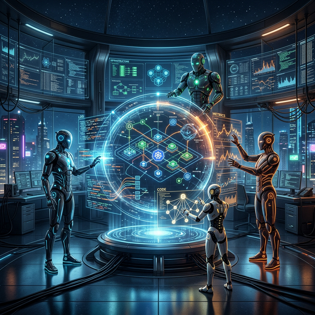
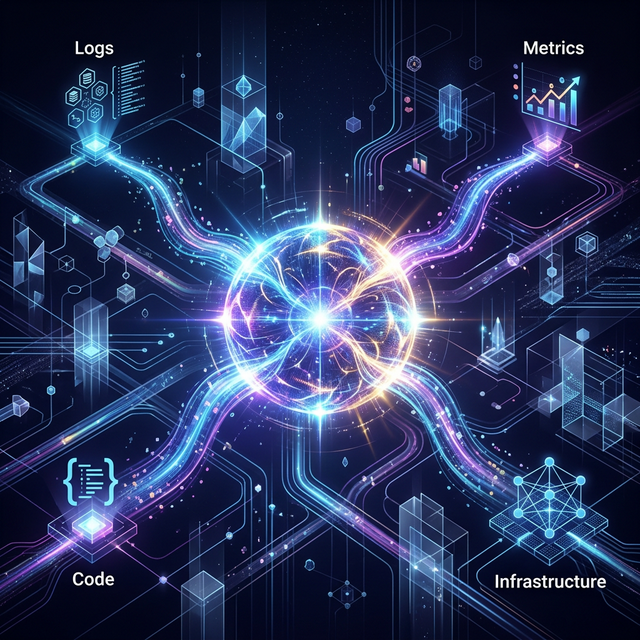
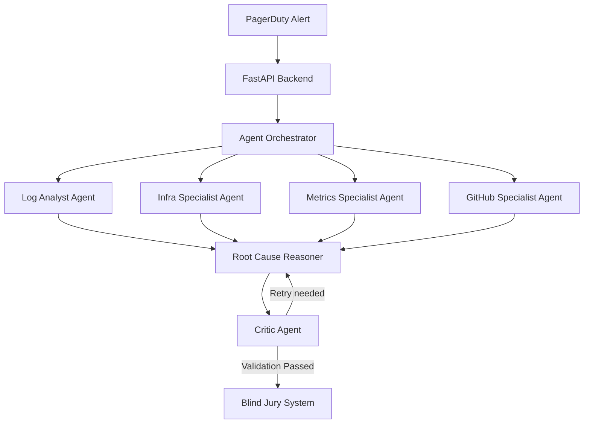
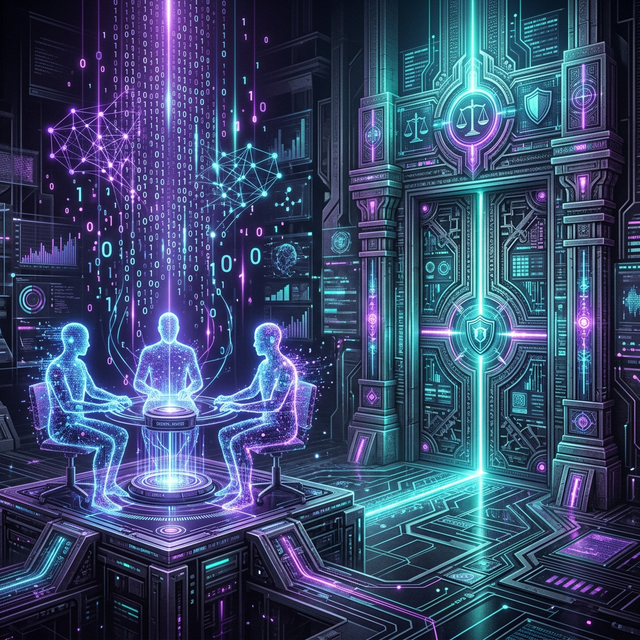
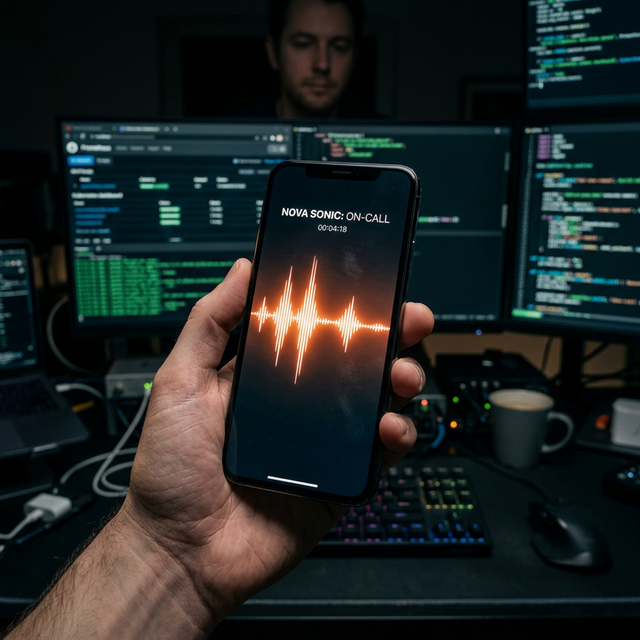

# NovaOps: The Autonomous SRE War Room on Amazon Bedrock

> Build a safe autonomous SRE war room with Bedrock. Includes reference architecture, design rationale, and a local Docker/LocalStack demo for agentic systems.



When a P1 incident hits at 3 AM, every second counts. Traditional SRE workflows often involve a frantic scramble through logs, metrics, and terminal windows. But what if your infrastructure could investigate itself? What if it could assemble a virtual "war room" of specialist agents, deliberate on a root cause, and call you on the phone to ask for verbal approval—all before you’ve even finished your first cup of coffee?

This is the vision behind **NovaOps v2**, an autonomous SRE ecosystem built entirely with the **Amazon Nova 2** family of foundation models on **Amazon Bedrock**.

In this deep-dive, we’ll explore the underlying complexity of our multi-agent orchestration, the "Blind Jury" pattern for hallucination-free reliability, and how we integrated real-time phone approval using **Amazon Nova Sonic**.

---

## 1. The Multi-Agent War Room: Parallel Problem Solving

NovaOps doesn't rely on a single, monolithic prompt. Instead, it utilizes a sophisticated orchestration layer that dispatches parallel specialist agents. When a PAGERDUTY webhook hits our FastAPI backend, the system spins up a virtual SRE team:

*   **Log Analyst Agent:** Utilizes Nova 2 Lite to parse high-cardinality logs, looking for crash traces and transient stack errors.
*   **Infra Specialist Agent:** Direct access to K8s API via managed tools to inspect pod restarts and resource limits.
*   **Metrics Specialist Agent:** Analyzes Prometheus trends for CPU/Memory spikes or anomalies using specialized visual reasoning.
*   **Deployment Analyst Agent:** Contextualizes findings against recent GitHub commits for configuration drift or bad merges.



### Orchestration Mechanics

The orchestrator manages the lifecycle of these specialists. Each agent operates in its own containerized sandbox, collecting evidence independently before submitting their findings to a **Root Cause Reasoner**.



---

## 2. Theoretical Trust: The "Blind Jury" Pattern

One of the biggest challenges in autonomous SRE systems is ensuring the AI doesn't "groupthink" its way into a bad remediation. To solve this, we developed the **Blind Jury** pattern—a zero-context validation layer.



### Independent Verification

While the "War Room" specialists are collaborating and sharing findings, a separate, isolated set of Nova 2 instances—the **Jury**—is given the *raw* telemetry data. They are not allowed to see the War Room's deliberations.

The system calculates a **Convergence Score ($C$)**:
$$C = \frac{S_{WarRoom} \cap S_{Jury}}{S_{Total}}$$

The system only proceeds to the Governance Gate if the War Room's conclusion and the Jury's verdict converge ($C > 0.85$). If they disagree, NovaOps triggers a confidence penalty and forces a human escalation. This redundant validation layer ensures that autonomous actions are backed by multiple, independent lines of reasoning.

---

## 3. The Voice of Reason: Amazon Nova Sonic Integration

For critical P1 incidents, we didn't want to just send a Slack notification. We wanted to talk to the engineer. 

By leveraging **Amazon Nova Sonic's** real-time voice capabilities and **Amazon Connect**, NovaOps can place an outbound call to the on-call engineer. 

### The Low-Latency Loop



The integration uses a Lambda bridge to stream audio between Amazon Connect and the Nova Sonic model on Bedrock. This allows for a conversational experience where the model can explain complex remediation plans verbally.

```python
# Conceptual Voice Approval Logic
def trigger_voice_approval(incident_id, plan):
    # Establish Sonic session
    session = bedrock.start_sonic_session(model="us.amazon.nova-sonic-v1")
    
    # Synthesize briefing
    briefing = session.speak(f"Nova detected {incident_id}. Plan is: {plan}. Approve?")
    connect.place_call(to=ONCALL_NUMBER, audio=briefing)
    
    # Listen for verbal approval
    response = connect.listen_for_keywords(["approve", "go ahead", "yes"])
    if response:
        execute_remediation(plan)
```

---

## 4. Continuous Self-Learning: Automated Runbook RAG

After every incident, NovaOps generates a comprehensive **Post-Incident Report (PIR)**. These aren't just for human review—they form the system’s long-term memory.

We implemented a **TF-IDF based Local RAG** system. Every PIR is synthesized into a concise "Runbook" format and indexed. The next time a similar incident occurs, the specialist agents automatically retrieve the "Root Cause" and "Remediation" from previous successful resolutions.

### The "Knowledge Evolution" Flow
1. **Incident Resolution:** War Room proposes a fix.
2. **Post-Mortem:** Nova 2 Pro synthesizes the entire timeline into a PIR.
3. **Indexing:** The PIR is saved as a PDF to S3 and its technical summary is indexed into the RAG vector store.
4. **Retrieval:** Future agents match incoming alerts against the Runbook library, reducing TTR (Time to Resolution) by up to 80%.

---

## Conclusion: The Future of Reliability

NovaOps v2 demonstrates that when we combine the power of foundation models like Amazon Nova 2 with robust engineering patterns like the Blind Jury, we can build infrastructure that is not only self-healing but fundamentally safer.

You can explore the full source code and try it yourself on GitHub: [NovaOps Repository](https://github.com/sujeetmadihalli/NovaOps)

Amazon Nova 2 isn't just another LLM—it's the engine for the next generation of autonomous ops.

---
*About the Author: Sujeet Madihalli is an SRE and AI Engineer focused on building safer, autonomous infrastructure.*
